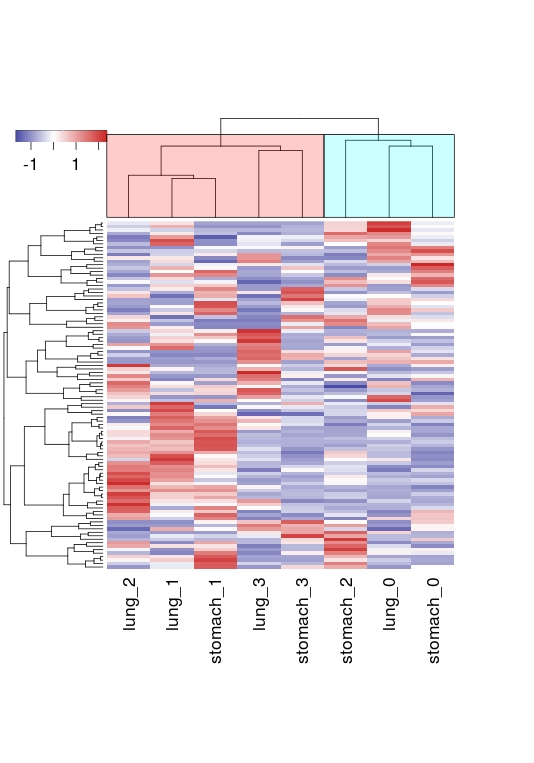
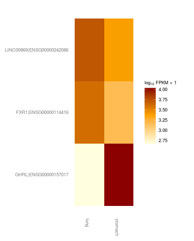
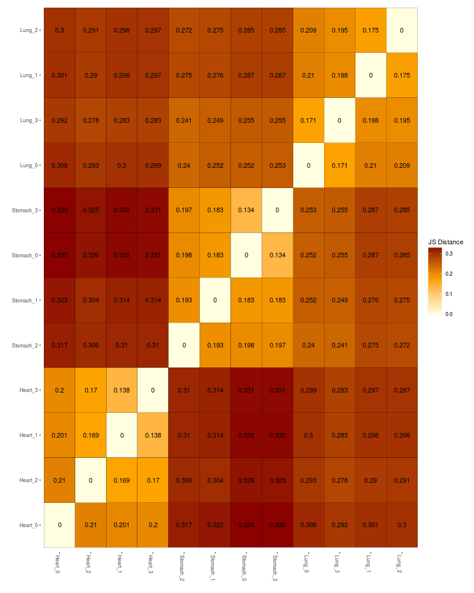
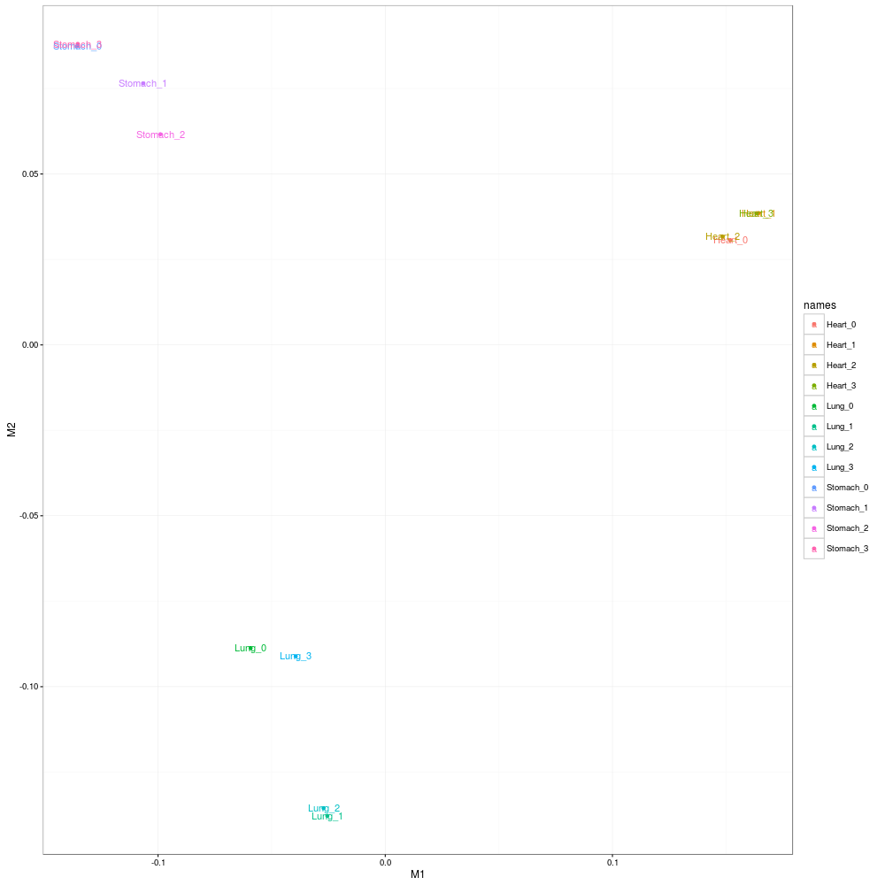

Title: The Shell and the Cloud - Applied Bioinformatics on the Example of Gene Expression Analysis using Unix and freely available Open Source Tools 
Author: Alexander Kerner 
EMail: teaching at silico-sciences.com 
Seminar Ruprecht-Karls-Universität Heidelberg 2016-01-20 - 2016-01-22

# Applied Bioinformatics in the Shell and in the Cloud

## NGS Data Analysis Using Unix and Open Source Tools 

[TOC]

# Data Visualization using RStudio and CummeRbund

## Preparations

0. Install [RStudio](https://www.rstudio.com/).

0. Install the [CummeRbund](http://compbio.mit.edu/cummeRbund/) package.

Download the [example data](cuffnorm_out)

## Create a heat map

1. (Copy `cuffnorm` output)
1. Load `genes.fpkm_table` into R

        fpkm_table = read.delim("genes.fpkm_table", row.names = 1, header = TRUE, sep="\t")

1. In the heatmap we want to display only genes that show a strong regulation between the samples. Calculate the Mean Absolute Deviation (MAD) of each gene across samples to get the average distance between each data value and the mean. This results in one value per gene identifier

        > mad_vector = apply(fpkm_table, 1, mad)
        > head(mad_vector)
        ENSG00000001617 ENSG00000003756 ENSG00000004399 ENSG00000004534 ENSG00000004838 ENSG00000007402 
        444.7197       2418.5216        453.4384       2870.0541        599.0401        129.0985
        
1. Sort values descending

        > mad_vector_sorted = mad_vector[order(mad_vector, decreasing = T)]
        > head(mad_vector_sorted)
        ENSG00000213178 ENSG00000168028 ENSG00000174748 ENSG00000233133 ENSG00000234287 ENSG00000162244 
        60275.17        49332.29        39065.25        31864.41        31546.61        18538.80  
        
1. Extract first 100 elements   

        > mad_top100 =mad_vector_sorted[1:100]  
        
1. Transform table into a matrix

        fpkm_matrix = as.matrix(fpkm_table)
        > head(fpkm_matrix)
                          lung_0  lung_3    lung_1    lung_2 stomach_0  stomach_1 stomach_2 stomach_3
        ENSG00000001617  683.958    0.00     0.000  261.9730   957.383    99.6764  699.5950   529.600
        ENSG00000003756 1954.310 3010.74  5925.110 3415.3400   152.799  6527.1900    0.0000  2257.020
        ENSG00000004399  137.821    0.00     0.000   98.4343   541.667  2778.8100  611.6800   686.690
        ENSG00000004534 2220.190 6278.09 12119.300 4787.7500  1647.350 10182.6000 1534.9700  1601.320
        ENSG00000004838 3190.500    0.00     0.000  509.9190   808.094     0.0000  421.9870   584.436
        ENSG00000007402  107.916    0.00   375.487    0.0000   210.593     0.0000   66.2355   544.656
        
1. Reduce matrix to top100 regulated gene IDs

        > fpkm_matrix_100 = fpkm_matrix[names(mad_top100),]
        > head(fpkm_matrix_100)
                         lung_0   lung_3   lung_1   lung_2 stomach_0 stomach_1 stomach_2 stomach_3
        ENSG00000213178 31040.6  41259.4 174005.0 108241.0   7973.69   69963.9   90244.8   8934.71
        ENSG00000168028 35832.5  50029.7 108015.0 113324.0   9335.06  172215.0   33976.2   9978.79
        ENSG00000174748 21576.2  22642.2  73926.2  66054.4   7048.10   65783.0   56496.9   4042.16
        ENSG00000233133 35046.7 104414.0  60632.2  70492.0      0.00   63570.0   27507.5  20941.10
        ENSG00000234287     0.0  11621.1  63999.4  70437.4      0.00   50591.4   22785.0  19770.80
        ENSG00000162244 12915.0  14307.1  59143.2  69294.3  10390.60   31414.3   35399.1   9669.11        
        
1. tt

        > hc = hclust(as.dist(1-cor(fpkm_matrix_100, method="spearman")), method="complete")
        > hr = hclust(as.dist(1-cor(t(fpkm_matrix_100), method="pearson")), method="complete")
        
1. Heatmap

        > library(heatmap3)
        > heatmap3(fpkm_matrix_100, Rowv=as.dendrogram(hr), Colv=as.dendrogram(hc), scale="row", balanceColor=T, showRowDendro=T, labRow=F, ColSideCut=0.9)
        
       

## CummeRbund

1. (Copy `cuffdiff` output)
1. `cd`into `cuffdiff` output directory

        > setwd("/home/alex/bi/2014fagerberg/cuffdiff_out-small")
    
1. Load the `cummeRbund` library

        > library(cummeRbund)
      
1. Read data into `CuffSet` object

        > cuff = readCufflinks()
        
1. Read genes into `CuffData` object

        > genes = genes(cuff)

1. Accessing data

    1. get run information
    
            > run_info = runInfo(cuff)
            > head(run_info)
                param           value
            1   cmd_line        cuffdiff -o cuffdiff_out-small -L lung,stomach -p8 -b /var/data/bi/reference/prebuild/Homo_sapiens/Ensembl/GRCh37/Sequence/Bowtie2Index/3.fa -u /var/data/bi/reference/prebuild/Homo_sapiens/Ensembl/GRCh37/Annotation/Genes/genes_chr03.gtf ERR315326/cuffquant_out-small/abundances.cxb,ERR315341/cuffquant_out-small/abundances.cxb,ERR315346/cuffquant_out-small/abundances.cxb,ERR315353/cuffquant_out-small/abundances.cxb ERR315369/cuffquant_out-small/abundances.cxb,ERR315379/cuffquant_out-small/abundances.cxb,ERR315467/cuffquant_out-small/abundances.cxb,ERR315485/cuffquant_out-small/abundances.cxb 
            2   version         2.2.1
            3   SVN_revision    4237
            4   boost_version   104700
    
    1. get sample names
    
            > sample_names = samples(genes)
            > head(sample_names)
            [1] "lung"    "stomach"

    1. get sample overview
    
            > replicates = replicates(cuff)
            > head(replicates)
                                                       file sample_name replicate  rep_name total_mass norm_mass  internal_scale external_scale
             1 ERR315326/cuffquant_out-small/abundances.cxb        lung         0    lung_0       1875   2780.32        0.873403              1
             2 ERR315341/cuffquant_out-small/abundances.cxb        lung         1    lung_1       3341   2780.32        0.981632              1
             3 ERR315346/cuffquant_out-small/abundances.cxb        lung         2    lung_2       3055   2780.32        0.876120              1
             4 ERR315353/cuffquant_out-small/abundances.cxb        lung         3    lung_3       1366   2780.32        0.589091              1
             5 ERR315369/cuffquant_out-small/abundances.cxb     stomach         0 stomach_0       3673   2780.32        1.595150              1
             6 ERR315379/cuffquant_out-small/abundances.cxb     stomach         1 stomach_1       3106   2780.32        0.924432              1

        
    1. get fold changes
    
            > genes_diff = diffData(genes)
            > head(genes_diff)
            gene_id sample_1 sample_2 status   value_1  value_2 log2_fold_change test_stat p_value  q_value significant
            1 ENSG00000001617     lung  stomach NOTEST  236.4830  571.564         1.273180  0.000000  1.0000 1.000000          no
            2 ENSG00000003756     lung  stomach NOTEST 3576.3700 2234.250        -0.678706  0.000000  1.0000 1.000000          no
            3 ENSG00000004399     lung  stomach NOTEST   59.0638 1154.710         4.289120  0.000000  1.0000 1.000000          no
            4 ENSG00000004534     lung  stomach     OK 6351.3300 3741.570        -0.763414 -0.296566  0.2263 0.650475          no
            5 ENSG00000004838     lung  stomach NOTEST  925.1040  453.629        -1.028100  0.000000  1.0000 1.000000          no
            6 ENSG00000007402     lung  stomach NOTEST  120.8510  205.371         0.765007  0.000000  1.0000 1.000000          no
            
    1. order table by significance       
    
            > head(genes_diff[order(genes_diff$significant, genes_diff$log2_fold_change, decreasing=T),])
                         gene_id sample_1 sample_2 status   value_1   value_2 log2_fold_change test_stat p_value q_value significant
            184  ENSG00000114416     lung  stomach     OK 4052.8100  1500.860        -1.433130 -0.424457 0.00585 0.04095         yes
            447  ENSG00000157017     lung  stomach     OK  485.1080 10424.200         4.425490  0.417135 0.00020 0.00420         yes
            2279 ENSG00000242086     lung  stomach     OK 5248.6100  2399.650        -1.129110 -0.318707 0.00050 0.00525         yes
            1    ENSG00000001617     lung  stomach NOTEST  236.4830   571.564         1.273180  0.000000 1.00000 1.00000          no
            2    ENSG00000003756     lung  stomach NOTEST 3576.3700  2234.250        -0.678706  0.000000 1.00000 1.00000          no
            3    ENSG00000004399     lung  stomach NOTEST   59.0638  1154.710         4.289120  0.000000 1.00000 1.00000          no 
            
    1. Extract significantly regulated gene IDs
    
            > genes_sig = genes_diff[order(genes_diff$significant, decreasing=T),][1:3,1]
            > genes_sig
            [1] "ENSG00000114416" "ENSG00000157017" "ENSG00000242086"
            
     1. Get gene data for extracted gene IDs
     
            > genes2 = getGenes(cuff, genes_sig)
            > genes2
            CuffGeneSet instance for  3  genes
            Slots:
                  	 annotation
                  	 fpkm
                  	 repFpkm
                  	 diff
                  	 count
                  	 isoforms	CuffFeatureSet instance of size 88 
                  	 TSS		CuffFeatureSet instance of size 63 
                  	 CDS		CuffFeatureSet instance of size 21 
                     promoters	CuffFeatureSet instance of size 3 
                     splicing	CuffFeatureSet instance of size 63 
                     relCDS		CuffFeatureSet instance of size 3 
         
1. Plot data

        > csHeatmap(genes2, cluster='both', replicates=T)
            
       
          
     
        > expressionBarplot(genes2)
        
       
           
        > csDistHeat(genes(cuff), replicates=T)
        
       
       
        > MDSplot(genes(cuff), replicates=T)
       
       
       
Get differentially expressed gene identifer

    > head(diffData(genes(cuff)))
                  gene_id sample_1 sample_2 status   value_1  value_2 log2_fold_change test_stat p_value  q_value significant
        1 ENSG00000001617     lung  stomach NOTEST  236.4830  571.564         1.273180  0.000000  1.0000 1.000000          no
        2 ENSG00000003756     lung  stomach NOTEST 3576.3700 2234.250        -0.678706  0.000000  1.0000 1.000000          no
        3 ENSG00000004399     lung  stomach NOTEST   59.0638 1154.710         4.289120  0.000000  1.0000 1.000000          no
        4 ENSG00000004534     lung  stomach     OK 6351.3300 3741.570        -0.763414 -0.296566  0.2263 0.650475          no
        5 ENSG00000004838     lung  stomach NOTEST  925.1040  453.629        -1.028100  0.000000  1.0000 1.000000          no
        6 ENSG00000007402     lung  stomach NOTEST  120.8510  205.371         0.765007  0.000000  1.0000 1.000000          no
    
Extract all significant gene identifiers

    > getSig(cuff,alpha=0.05,level="genes")
    [1] "ENSG00000114416" "ENSG00000157017" "ENSG00000242086"
         
## References

0. [Differential gene and transcript expression analysis of RNA-seq experiments with TopHat and Cufflinks](http://www.ncbi.nlm.nih.gov/pmc/articles/PMC3334321/?tool=pmcentrez)

0. [CummeRbund manual](http://compbio.mit.edu/cummeRbund/manual_2_0.html)  
           
